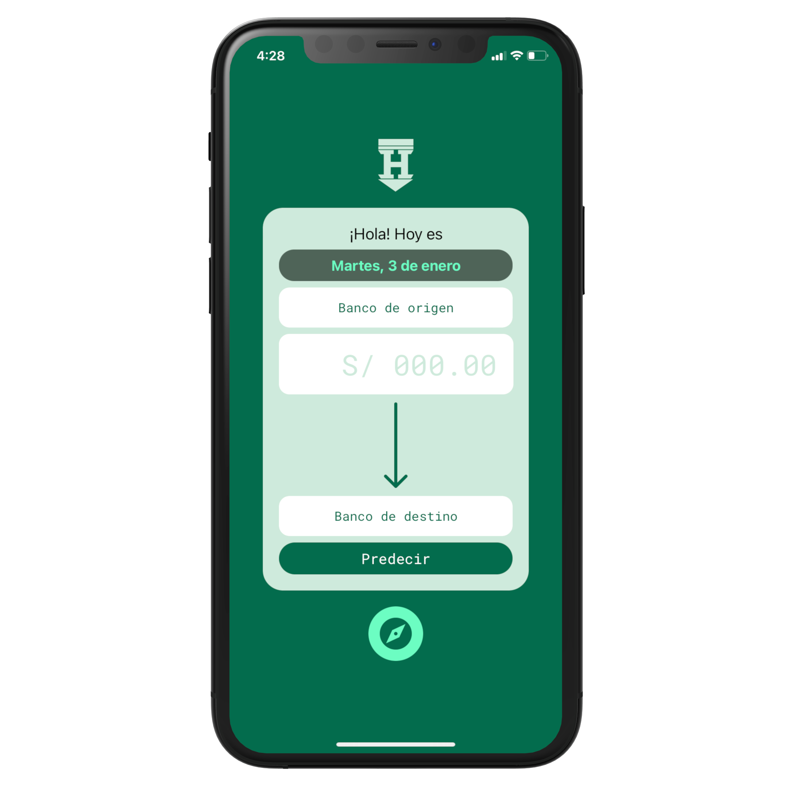
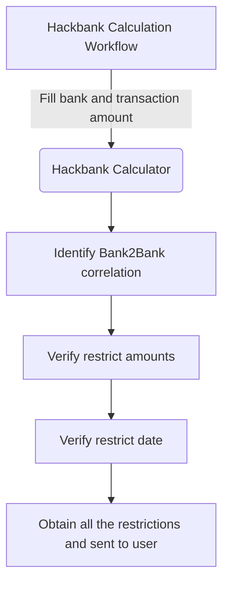

<p align="center">
  
  <h1 align="center">💵 Hackbank 📲</h1>
</p>

<p align="center">
  Bank-to-Bank Transaction Calculator Multiplaform App (for Peru)
</p>

<p align="center">
    <a href="https://web.hackbank.app">💻 Web App</a> -
    <a href="https://play.google.com/store/apps/details?id=io.hackbank.app">🤖 Install on Android</a> -
    <a href="https://apps.apple.com/us/app/hackbank/id1635247314">🍎 Install on iOS</a>
</p>

<p align="center">
  
</p>


<p align="center">
  ✅ This project has diagrams to help you understand how it works! 📌
</p>


## 📖 Concept

**Hackbank** is a mobile application that allows you to calculate the commissions and delays of a bank-to-bank transaction. It is designed for the Peruvian market. And it is available for Android, iOS and Web.

## 🛠 Development

Hackbank is developed in [React Native](https://reactnative.dev) with [Expo](https://expo.dev).

Linting is used with **ESLint**.

It consists of three screens (`src/screens`):

- **Form**: User can fill in the data about a transaction.
- **Result**: User can review the prediction of commissions (and other elements) on the transaction.
- **About**: Information about the application, version, tutorials, etc.

### 🤖 Operation



The operation of the prediction consists of the automatic review of a JSON file called **Transfer Restriction Calculator** (**TRC** from now on).

This `TRC.json` file contains the rules by which the data of a transaction is evaluated.

```json
[
  {
    "inputBank": "IBK",
    "inputBankName": "Interbank",
    "inputBankAccountType": "Cuenta Simple",
    "outputBank": "SCO",
    "outputBankName": "Scotiabank",
    "outputBankAccountType": "Cuenta Free",
    "restrictAmounts": [
      {
        "type": "maximum",
        "amount": "10000",
        "currency": "PEN"
      }
    ],
    "restrictDate": {
      "days": "BUSINESS",
      "hours": [
        {
          "start": "0:00",
          "end": "04:30",
          "type": "deferred_cut"
        },
...
```

### 📌 Example of operation

**ABC** bank provides a commission of `50` when the amount exceeds more than `500`.

So TRC has an object that contains information about that rule, and it warns that if it passes more than `50`, the commission will be applied.

If the user calculates that the source bank is ABC, and the destination bank is DEF, and the amount is `1000`. When calculating the result, the TRC is checked, and since there is this condition that ABC provides a condition of `50` when the amount exceeds more than `500`, **Hackbank** will inform the user of a commission.

## 📦 Deployment

### 📱 For Android and iOS

To publish Hackbank, a Google and Apple developer account is required. To make the build I used EAS (Expo Application Services).

### 💻 For Web

To publish in web I'm using [Firebase Hosting](https://firebase.google.com/docs/hosting). The following commands are used to deploy:

```json
  "predeploy": "expo build:web",
  "deploy-hosting": "npm run predeploy && firebase deploy --only hosting"
```

## 🏛️ History

I started this app at a Starbucks, while I wanted to send money I found that my transaction was going to be delayed. So I had the idea to create an application that could predict how a transaction would behave from one bank to another bank.

## 🎨 UI Design

I started to create the sketches of the design in Figma. I designed four screens, one for the splash screen, another for the form, another for the result and for the information page (with contact).

## 🤲 Contributing

Do you would like to contribute? Do you want to be the author of a new feature? Awesome! please fork the repository and make changes as you like. [Pull requests](https://github.com/360macky/hackbank/pulls) are warmly welcome.

You can also suggest features. Don't be afraid! 🤍

## 📃 License

Distributed under the MIT License.
See [`LICENSE`](./LICENSE) for more information.
